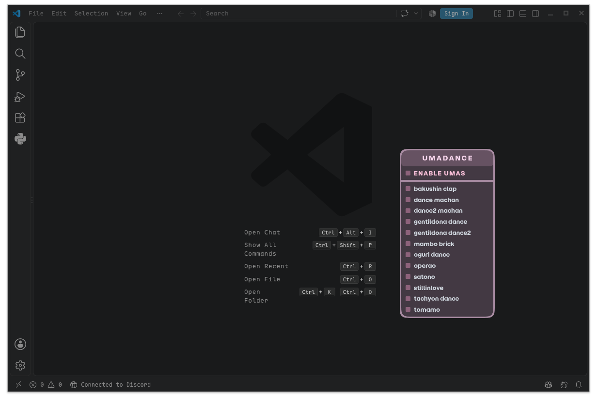
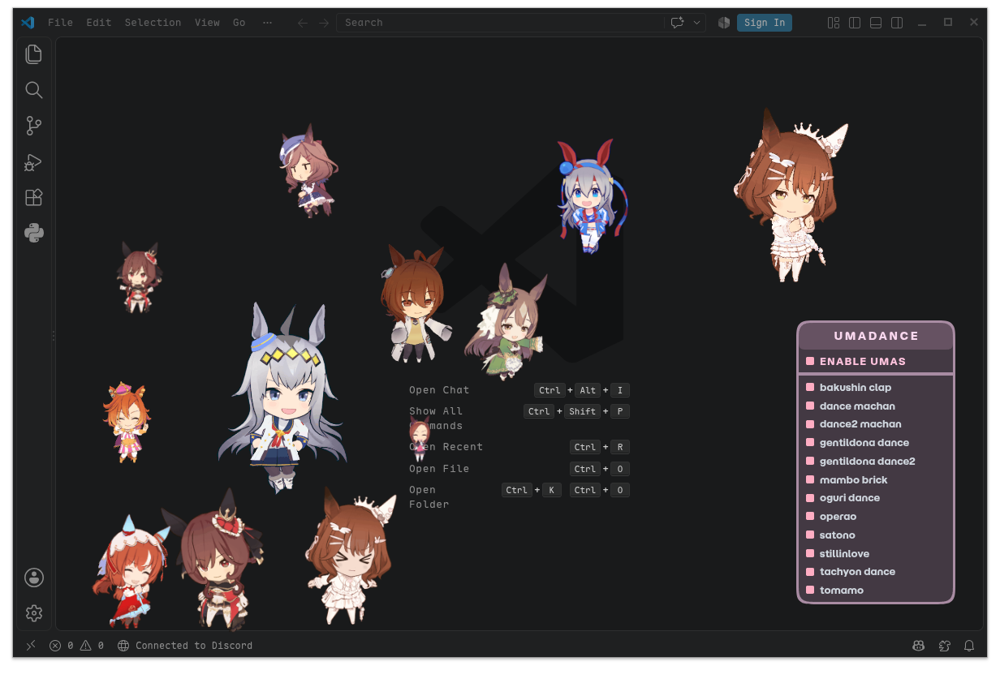
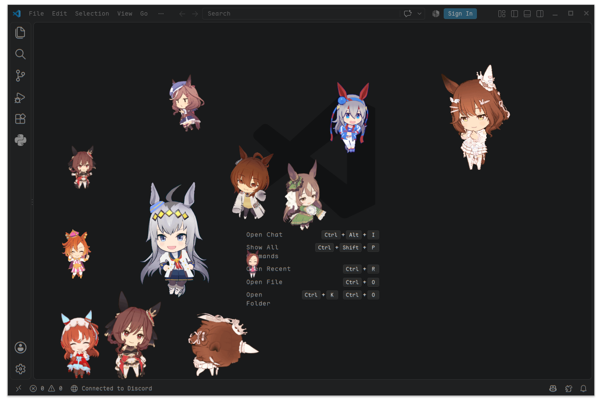

<div align="center">

## 🌸 UMADANCE 🌸
**an VSCode extension, that shows uma's from umamusume dancing around ur working enviroment.**

</div>

### Install

**VS Code, VSCodium, Cursor, Windsurf, anything else**

- VS Code Marketplace: [moxiu.umadance](https://marketplace.visualstudio.com/items?itemName=moxiu.umadance)
- Open VSX (VSCodium and every other Open VSX editor): [moxiu.umadance](https://open-vsx.org/extension/moxiu/umadance)

Or build a `.vsix` and install it yourself, on any OS:

```
bun run vsix
code --install-extension ./umadance-0.0.3.vsix
```

Needs VS Code / VSCodium **1.75 or newer**. `engines.vscode` is not hand-written: `scripts/pin-engines.js` regenerates it from the pinned `@types/vscode` version on every package/publish, so it can never drift out of range again.

The uma float over the whole window by patching `workbench.html` inside the editor install. That needs a writable install (per-user installs, or a system install owned by your user). On read-only installs the uma still dance inside the panel. On macOS the patched bundle loses its signature, so re-sign it (`codesign --force --deep --sign - "/Applications/Visual Studio Code.app"`) or work from a per-user copy of the app.

**NixOS / Nix**

add this flake:

```nix
inputs.umadance = {
  url = "github:cfels/umadance";
  inputs.nixpkgs.follows = "nixpkgs";
};
```

Then enable the module for a patched `programs.vscode`:

```nix
modules = [ umadance.nixosModules.default { programs.umadance.enable = true; } ];
```

Or just apply the overlay, if you would rather keep `pkgs.vscode` patched globally:

```nix
nixpkgs.overlays = [ umadance.overlays.default ];
```

### Compile extension

**VS Code (any OS)**

just run:

```
./build-ext.sh --vsix
```

### Publish

Both stores in one shot - the `.vsix` is built once and that exact file is uploaded to each:

```
bun run publish:all
```

Put the tokens in a `.env` next to `package.json` (git-ignored, `chmod 600` it):

```
VSCE_PAT=your-azure-devops-token
OVSX_PAT=your-open-vsx-token
```

Exported environment variables work too and win over `.env`.

First time on Open VSX only - the registry needs the namespace before it accepts an upload:

```
bun run namespace:ovsx
bun run publish:all
```

One store at a time, or a build-only dry run:

```
bun run publish          # VS Code Marketplace only (VSCE_PAT)
bun run publish:ovsx     # Open VSX only (OVSX_PAT)
bun run publish:all --dry-run
```

`namespace:ovsx` makes you a contributor on `moxiu`, which lets you publish there. To get the _verified_ badge you additionally claim ownership: sign in at [open-vsx.org](https://open-vsx.org), then open an issue in [EclipseFdn/open-vsx.org](https://github.com/EclipseFdn/open-vsx.org/issues/new/choose).

### Usage
INSERT - to open/close the menu

### Screenshots

<table border="0">
  <tr>
    <td>
      <br><br>
      <br><br>
      
    </td>
  </tr>
</table>


### License
this project is licensed under [MIT License](https://github.com/cfels/umadance/blob/main/LICENSE)
